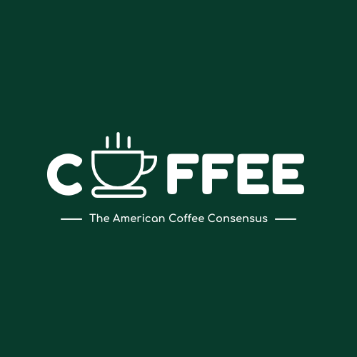

# Maven Coffee Challenge
A group of investors looking to break into the US coffee market would like to leverage insights from "The Great American Coffee Taste Test."

## Project Overview
I've been asked to share an explanatory report providing a data-driven strategy for opening their first coffee shop. The investors expressed interest in the following areas, but are open to any additional insights and recommendations I can provide:

- __Target audience:__ What type of customer should we target, and what are their preferences?
- __Product offering:__ What types of coffee beans and drinks should we offer?
- __Pricing strategy:__ How can we align prices with customer value perception?

## About The Data Set
The data contains survey responses from ~4,000 Americans after a blind coffee taste test conducted by YouTube coffee expert James Hoffmann and Cometeer. This first-of-its-kind experiment was designed to provide a largely identical tasting experience for people across the country. After the tasting, and once the surveys were submitted, details about each of the 4 coffees they tasted were revealed.

In 2023, Cometeer partnered with YouTube coffee expert and world champion barista James Hoffmann to host [The Great American Coffee Taste Test](https://cometeer.com/pages/the-great-american-coffee-taste-test). To conduct this first-of-its-kind preference experiment, Cometeer shipped 5,000 coffee kits across America with four different coffees. These were pre-extracted and flash frozen, allowing tasters to melt and dilute the coffee capsules at home for a largely identical tasting experience, all while following along with James during a [YouTube livestream](https://www.youtube.com/watch?v=U489K2t_Tgc) on October 21st, 2023.

The tastings and ratings were conducted blind, but after the survey responses were collected some of the attributes of the coffe were revealed:

- Coffee A: light roast, washed process
- Coffee B: medium roast
- Coffee C: Dark roast
- Coffee D: Light roast, natural process (fermented, funky/fruity)

These were selected to answer 3 main questions:

1. What roast level do Americans prefer? (light [A] vs medium [B] vs dark [C])
2. Do they show a preferences for fermented, fruity flavors? (washed [A] vs natural [D])
3. What is the most popular coffee?

To help break down the results, the survey also included questions on each taster's demographics and coffee drinking & spending habits.

This data set was downloaded from [Maven Analytics](https://mavenanalytics.io/challenges/maven-coffee-challenge/30)

